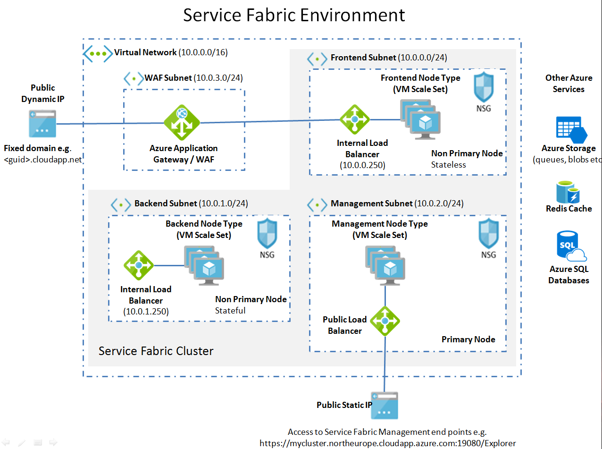

<h2>3 node type service fabric environment in Azure with an application gateway</h2>

This area contains the scripts to create a 3 node type service fabric envionment in Azure with an Application Gateway at the front end, and uses an existing virtual network (a script is also provided to create this)

1. Edit the parameters in "Azure-CreateDependanciesForServiceFabricPlatform.ps1", then execute it to create the Service Fabric dependancies first.

2. Edit the parameters.json in folder 'secureTemplateAnd3NodeTypeWithApplicationGatewayAndExistingSubnet', then execute deploy.ps1 to create the service fabric cluster

I wrote a blog post about this too: http://jonlanceley.blogspot.co.uk/2017/04/3-node-service-fabric-environment-with.html
